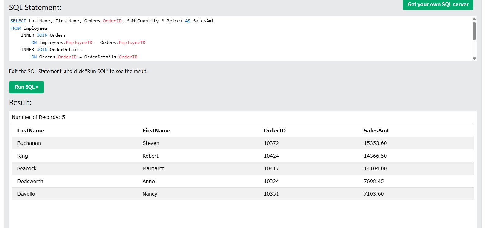
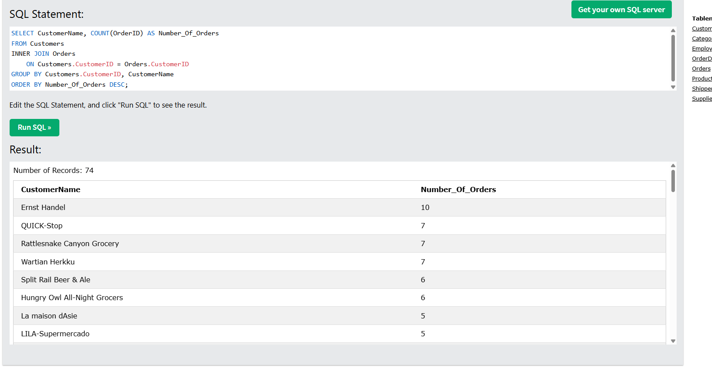

# SQL Data Analysis & Business Intelligence Portfolio

This repository contains a structured walkthrough of multi-step SQL data analysis projects. It demonstrates how to query, join, aggregate, and filter relational database tables to solve core business problems using the W3Schools (Northwind) database environment and Coursera's Guided Project.

---

## Project Overview

### 1. Sales Order & Employee Performance Analysis
* **The Business Question:** *Which specific target orders generated the highest total sales, and which sales representatives were responsible for processing them?*
* **Business Value:** 
  * **Sales Performance Tracking:** Directly links staff members to top-performing or targeted transactions to evaluate individual sales execution.
  * **Granular Revenue Insight:** Transforms raw line-item data into meaningful financial totals (`Quantity * Price`).
  * **Targeted Reporting & Auditing:** Isolates specific cohorts for management review and ranks results to highlight top revenue generators.

### 2. Customer Order Volume Analysis
* **The Business Question:** *How many total orders have been placed by each customer so that sales management can effectively assign customer accounts to new sales representatives?*
* **Business Value:** 
  * **Account Allocation & Workload Distribution:** Empowers sales management to balance workloads fairly among incoming or new sales reps based on historical transaction volume.
  * **Customer Tiering:** Identifies top-tier clients (such as *Ernst Handel* with 10 orders) to prioritize high-value relationship management.

---

## Technical Concepts Covered

* **Database Schema & Relational Structure:** Understanding how tables are organized into rows, columns, and linked via foreign keys.
* **Table Joins (`INNER JOIN`):** Combining related data across multiple tables (Customers, Orders, Employees, OrderDetails, and Products) based on shared keys.
* **Calculated Fields:** Generating temporary derived metrics on the fly (e.g., line-item sales calculations).
* **Aggregation & Grouping (`SUM`, `COUNT`, `GROUP BY`):** Summarizing transactional data into meaningful operational metrics.
* **Filtering & Sorting (`WHERE`, `HAVING`, `ORDER BY`):** Isolating target data cohorts before or after aggregation and sorting outputs cleanly by performance metrics.

---

## SQL Scripts

### Query 1: Sales Analysis by Target Order ID
```sql
--CREATED BY: LAQUITA JORDAN
--CREATE ON: 8/1/2026
--DESCRIPTION: Which specific target orders generated the highest total sales, and which sales
--representatives were responsible for processing them?

SELECT LastName, FirstName, Orders.OrderID, SUM(Quantity * Price) AS SalesAmt
FROM Employees
    INNER JOIN Orders 
        ON Employees.EmployeeID = Orders.EmployeeID 
    INNER JOIN OrderDetails 
        ON Orders.OrderID = OrderDetails.OrderID
    INNER JOIN Products 
        ON OrderDetails.ProductID = Products.ProductID
WHERE Orders.OrderID IN (10372, 10424, 10417, 10324, 10351)
GROUP BY Orders.OrderID, LastName, FirstName
ORDER BY SalesAmt DESC;
```
### Query Results



### Results Summary

The analysis evaluated **five targeted sales orders** and calculated the total sales amount for each order by multiplying product quantity by unit price. It then linked each order to the responsible sales representative and ranked the results by total sales.

| Sales Representative | Order ID | Total Sales |
|----------------------|---------:|------------:|
| Steven Buchanan | 10372 | $15,353.60 |
| Robert King | 10424 | $14,366.50 |
| Margaret Peacock | 10417 | $14,104.00 |
| Anne Dodsworth | 10324 | $7,698.45 |
| Nancy Davolio | 10351 | $7,103.60 |

### Key Insights

- Steven Buchanan processed the highest-value order at **$15,353.60**.
- The top three orders each generated more than **$14,000** in sales.
- The query demonstrates how SQL joins multiple tables to connect employees, orders, products, and order details into a single business report.
- This analysis can support sales performance reporting, revenue tracking, and management decision-making.
---
### Query 2: Customer Order Volume Summary
```sql
--CREATED BY: LAQUITA JORDAN
--CREATE ON: 8/1/2026
--DESCRIPTION: How many total orders have been placed by each customer so that sales management can
--effectively assign customer accounts to new sales representatives?

SELECT CustomerName, COUNT(OrderID) AS Number_Of_Orders
FROM Customers
INNER JOIN Orders 
    ON Customers.CustomerID = Orders.CustomerID
GROUP BY Customers.CustomerID, CustomerName
ORDER BY Number_Of_Orders DESC;
```
### Query Results



### Results Summary

The analysis returned **74 customers** with recorded orders.

**Key insights**

- Ernst Handel placed 10 orders.
- Multiple customers placed between 6–7 orders.
- Sales managers can use this information to balance workloads and identify high-value customer relationships.

---

**LaQuita Jordan**  
M.S. Data Analytics Student | U.S. Navy Veteran

Building a portfolio of SQL, Python, and Power BI projects that solve real business problems.

